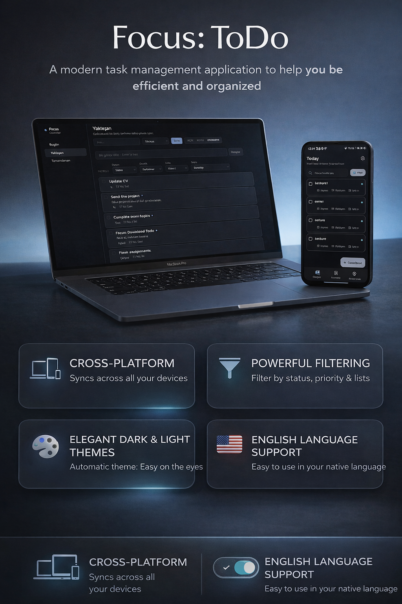
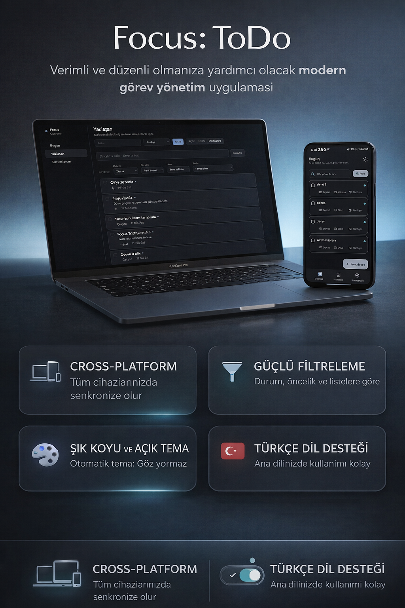

# Focus Todo

  
  

Focus Todo is a cross-platform task management application built with a local-first architecture and an experimental manual synchronization system.

The project consists of:
- A desktop application built with React and TypeScript
- A mobile application built with Flutter

---

## Overview

Focus Todo explores:
- Local-first data management
- Cross-platform state consistency
- Manual synchronization strategies between devices

The application works fully offline and persists data locally, with a prototype sync layer designed for future cloud integration.

---

## Architecture

- Local-first approach  
- Independent state per client (desktop and mobile)  
- Persistent local storage on both platforms  
- Manual sync pipeline (push / pull / merge)  
- Shared task model and canonical mapping  
- Transport abstraction via sync registry  

---

## Tech Stack

Desktop:
- React
- TypeScript
- Vite

Mobile:
- Flutter
- Dart
- Riverpod

Backend (Experimental):
- Supabase

---

## Features

Completed:
- Task creation, editing, and deletion
- Task completion tracking
- Local persistence on both platforms
- Shared task model across platforms
- Manual sync trigger interface
- Sync pipeline architecture
- Transport abstraction layer

Partial / Experimental:
- Cross-device sync (prototype level)
- Supabase integration (not finalized)
- Basic conflict resolution (timestamp-based)

Not Implemented:
- Authentication
- Real-time synchronization
- Production-ready backend
- Advanced conflict resolution
- Retry/queue system for offline sync

---

## Sync System

The project includes a manual sync architecture prototype.

However:
- It is not production-ready
- Backend contract is not finalized
- Cross-device consistency is not guaranteed

This part of the project is intended for architectural exploration.

---

## Project Structure

focus_todo_computer/
└── focus-todo/

focus_todo_mobile/

screenshots/
docs/

---

## Setup

Desktop:

cd focus_todo_computer/focus-todo
npm install
npm run dev

Mobile:

cd focus_todo_mobile
flutter pub get
flutter run

---

## Current Status

This project is a portfolio-level prototype focused on architecture, state management, and cross-platform design.

It is not intended for production deployment.

---

## Known Limitations

- Sync may fail due to incomplete backend setup
- No authentication or user isolation
- No guarantee of data consistency across devices
- Backend contract is not stable

---

## Author

Altan Yüce